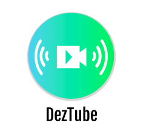
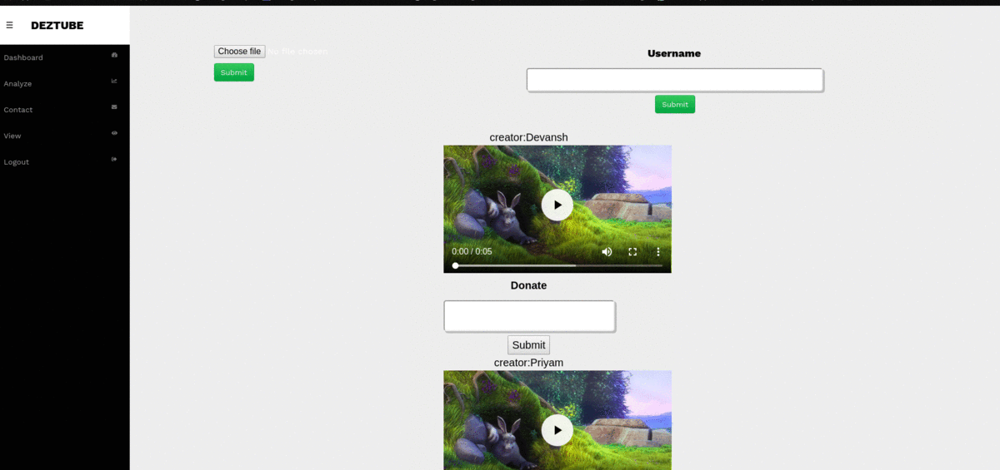

<p align="center">
  <a href="" rel="noopner">
    </a>

<h1 align="center">DezTube</h1>
<h4>A Decentralized Youtube</h4>


------------------------------------------
### So what is the point of such a system?

<p>Let's go deeper. There are three parties involved in this market. Users, platform providers and content creators. The <b><u>users dictate</b></u> the terms. Where they go the others follow.
</p>
<br>
  <h2>Centralized System</h2>

There is a monopoly in the market for content control, control over what a user views, direct actions can be taken by monopolies to fire a content creator without even noticing him/her, Not much transparency in data, Can Increase fare anytime.


------------------------------------------
### Features

* We are building a DApp which will enable viewers and content creators to interact directly without any 3rd Party getting in and controlling a viewers view or creators content.<br/>
* We provide users a platform to upload their contents and view other user's content.<br/>
* We provide appreciation method that is a user can donate content creators for their content.<br/>
* The Users have rights to view a Ad or block it.<br/>
* The AdAgency can place their Ads on monthly/yearly basis to the platform.<br/>
* The content creator will be appreciated with tokens once a certain number of users like his/her content.<br/>
* The Users get benefitted for watching the Ads.<br/>

------------------------------------------
### Demo

<p align="center">
<h1> Donate Demo </h1>

</p>

------------------------------------------
### Installation
  * Step I: Clone the Repository
```sh
      $ git clone https://github.com/Hash-It-Out/DezTube.git     
```
  * Step II: Install packages
```sh
      # On the terminal move into DezTube package directory
      $ cd DezTube
      $ npm install
```

* Step III: Run DApp
```sh
      $ npm start
```
### Future Works

~ `Implement Live Streaming video with HLS.`<br/>
~ `Reward Token`<br/>
~ `UI Improvements`<br/>
